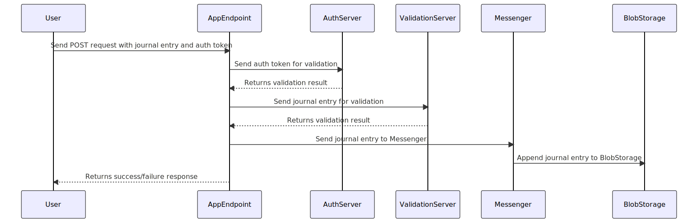

# go-journal - CLI client for quick structured journaling

# Design


## Requirements

- Golang 1.20

## Installation

### Golang

go-journal requires Golang 1.19. You can install it by following the [default instructions](https://golang.org/doc/install) or via homebrew

```bash
brew install go@1.20
```
## Local Development

Before doing any local development, you need to install the required packages by running the following command:

```bash
make install-deps
```

There are two options for running go-journal locally while doing development: using [Air](#using-air) or [directly running](#building-and-running)

### Using Air

go-journal is setup to use [Air](https://github.com/cosmtrek/air) which is a file watcher and live reload setup for Go apps. To use Air, run the following command:

```bash
# Downloads air to ./bin/air if necessary
make dev
```
This will download Air to ./bin/air if necessary.

### Building and Running

To build the binary, run the following command:

```bash
# Just builds the binary and outputs it to ./bin/go-journal
make build
```

This will build the binary and output it to ./bin/go-journal

To build and automatically run the binary, run the following command:

```bash
# Builds the binary and automatically runs
make start
```
