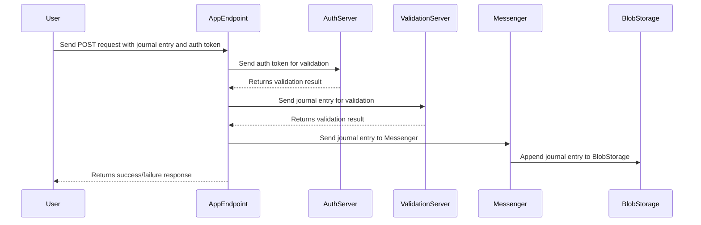

<!-- ```mermaid
sequenceDiagram
    participant User
    participant AppEndpoint
    participant Messenger
    participant BlobStorage

    User->>AppEndpoint: Sends POST request with journal entry
    AppEndpoint->>Messenger: Sends journal entry to Messenger
    Messenger->>BlobStorage: Appends journal entry to BlobStorage

    AppEndpoint->>User: Returns success/failure response
``` -->


